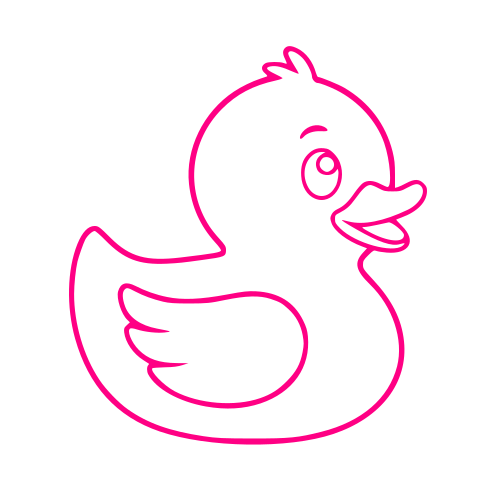

---
layout: splash
title: "러버덕 블로그에 오신 것을 환영합니다."
date: 2025-02-11
# toc: true
# toc_label: "목차"
# toc_icon: "list-squares"
# categories: about
# tags: [about]
# author_profile: true
permalink: /about/
# sidebar:
#   nav: "sidebar-category"
---

  

  

    

      
      
FRONTEND / FULLSTACK DEVELOPER

    

    <h1 style="font-size: 2.5rem; font-weight: 700; line-height: 1.2">
      
      ▍
    </h1>
    

      배운 것과 고민한 과정을 기록하며 스스로 돌아보고 — 필요할 때 다시 꺼내 보는 개발 블로그입니다.
    

    

      <a href="/" class="button_home">블로그 둘러보기 →</a>
    

    
SCROLL ↓

  

  <section
    style="
      position: relative;
      z-index: 1;
      padding: 120px 50px;
      opacity: 1;
      transform: translateY(0px);
      transition:
        opacity 0.9s,
        transform 0.9s;
      border-top: 1px solid rgba(255, 255, 255, 0.06);
    "
  >
    

      ABOUT
    

    <h2
      style="
        font-size: clamp(24px, 3vw, 34px);
        font-weight: 600;
        line-height: 1.5;
        margin: 0px 0px 20px;
        max-width: 720px;
      "
    >
      안녕하세요,
      박덕기입니다. 다들 저를
      러버덕이라고 불러요.
    </h2>
    

      복잡한 문제를 소리 내어 설명하다 보면 실마리가 풀리곤 합니다. 이 블로그는 그 과정을 그대로
      옮겨 적은 기록이에요 — 막힌 부분, 삽질한 흔적, 찾아낸 답까지... 
      <i>누군가에게는 제가 그 옆에 놓인 작은 러버덕이 되었으면 합니다.</i>
    

  </section>
  <section
    style="
      position: relative;
      z-index: 1;
      padding: 120px 50px;
      opacity: 1;
      transform: translateY(0px);
      transition:
        opacity 0.9s,
        transform 0.9s;
      border-top: 1px solid rgba(255, 255, 255, 0.06);
    "
  >
    

      STACK
    

    

      HTML/CSS
      JavaScript
      TypeScript
      React
      Next.js
      Node.js
      Python
      Infra/DevOps
      Git
    

  </section>
  <section
    id="contact"
    style="
      position: relative;
      z-index: 1;
      padding: 120px 50px 140px;
      opacity: 1;
      transform: translateY(0px);
      transition:
        opacity 0.9s,
        transform 0.9s;
      border-top: 1px solid rgba(255, 255, 255, 0.06);
    "
  >
    

      CONTACT
    

    

      <a
        href="https://www.linkedin.com/in/%EB%8D%95%EA%B8%B0-%EB%B0%95-175621221/"
        target="_blank"
        style="color: rgb(238, 241, 243); display: flex; align-items: center; gap: 10px"
        >LinkedIn 박덕기</a
      >
      <a
        href="https://github.com/Deokgi-Park"
        target="_blank"
        style="color: rgb(238, 241, 243); display: flex; align-items: center; gap: 10px"
        >GitHub @Deokgi-Park</a
      >
      <a
        href="mailto:ejrrl6931@gmail.com"
        target="_blank"
        style="color: rgb(238, 241, 243); display: flex; align-items: center; gap: 10px"
        >Email ejrrl6931@gmail.com</a
      >
    

    

      Built with Jekyll · minimal-mistakes (neon)
    

  </section>
  

